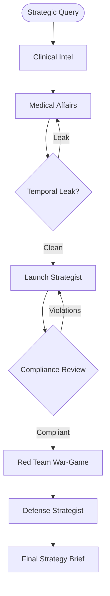

# 🚀 Oncology Launch War-Room

**Oncology Launch War-Room** is a multi-agent orchestration system designed to simulate competitive clinical strategy and regulatory navigation for high-stakes pharmaceutical launches. 

The system focuses on the **KRAS G12C inhibitor race** (Sotorasib vs. Adagrasib), providing a high-fidelity "time-travel" sandbox where users can strategize using only data available prior to **January 15, 2021**.

## 🛡️ Key Features

### 1. Temporal Sandbox (The January Cutoff)
Every part of the system is strictly air-gapped from "future knowledge." 
- **SQL Guardrails:** Every database query automatically injects a `study_first_submitted_date < '2021-01-15'` filter.
- **RAG Integrity:** Dense vector searches are metadata-filtered by `published_date`.
- **LLM Hallucination Firewall:** A dedicated **Temporal Validator** scans agent outputs for mentions of post-2021 events or drug brand names (e.g., Lumakras, Krazati), triggering automatic retries with corrective feedback.

### 2. Multi-Agent Orchestration (LangGraph)
The system uses a sophisticated state machine to coordinate specialized agents:
- **Clinical Intel:** Queries AACT/SQLite for trial data and population demographics.
- **Medical Affairs:** Performs RAG on a curated corpus of PubMed literature and FDA labels.
- **Launch Strategist:** Synthesizes technical data into a strategic commercial brief.
- **PRC Agent (Legal/Compliance):** Simulates a Promotional Review Committee, flagging off-label claims and safety omissions.
- **Red Team:** Simulates a competitor's aggressive war-gaming counter-messaging.
- **Defense Strategist:** Rebuts the Red Team attack while maintaining compliance.

### 3. Secure Infrastructure
- **Analytical SQL Support:** Agents can execute complex `GROUP BY` and `COUNT` operations to identify landscape voids.
- **Read-Only Database:** All agent-facing connections are open in `?mode=ro` to prevent destructive SQL injection.
- **Citation Validator:** Automatically strips hallucinated PMIDs and NCT IDs before the final brief is delivered.

## 🛠️ Architecture



## 🚀 Getting Started

### Prerequisites
- Docker & Docker Compose
- Google Gemini API Key (set in `.env`)

### Installation
1. Clone the repository.
2. Create a `.env` file with `GOOGLE_API_KEY=your_key`.
3. Build the container:
   ```bash
   docker compose up -d
   ```

### Running the War-Room
```bash
docker compose exec app python scripts/run_warroom.py --query "How should we position Sotorasib against MRTX849 in 2L NSCLC?"
```

### Running Evaluations
```bash
docker compose exec app pytest
docker compose exec app python scripts/run_evals.py
```

## 📊 Dataset
The system relies on a curated subset of:
- **AACT (ClinicalTrials.gov):** Relational trial data.
- **PubMed:** Scientific abstracts.
- **OpenFDA:** Drug labels and safety reports.

---
*Disclaimer: This is a simulation tool for educational and strategic research purposes.*
